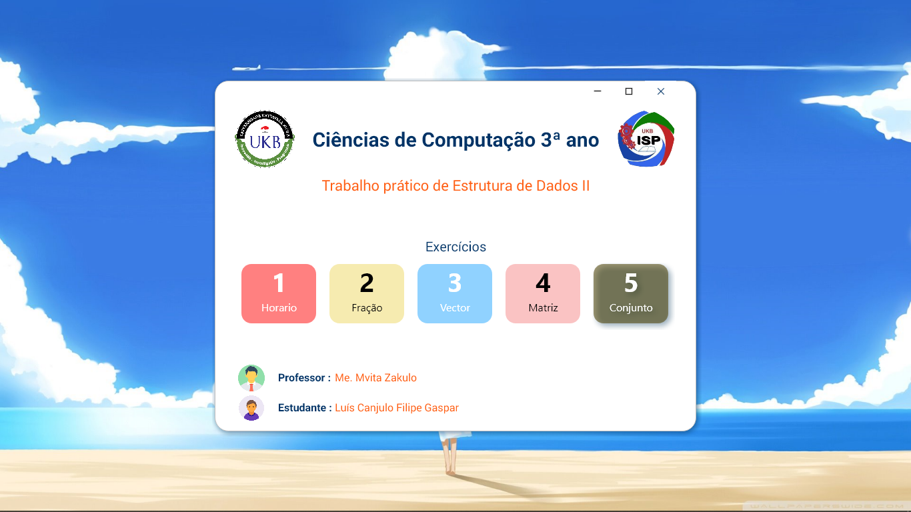
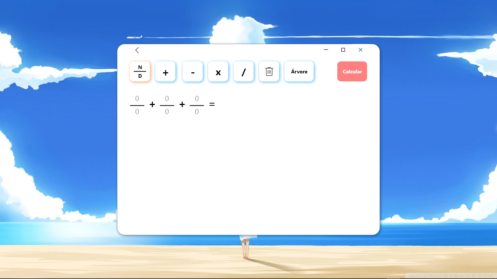
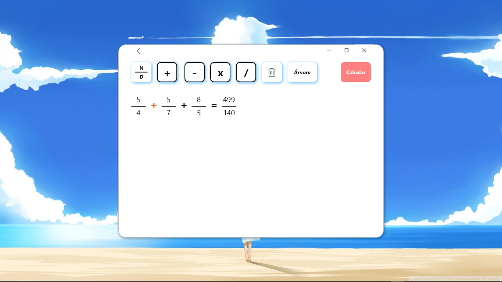
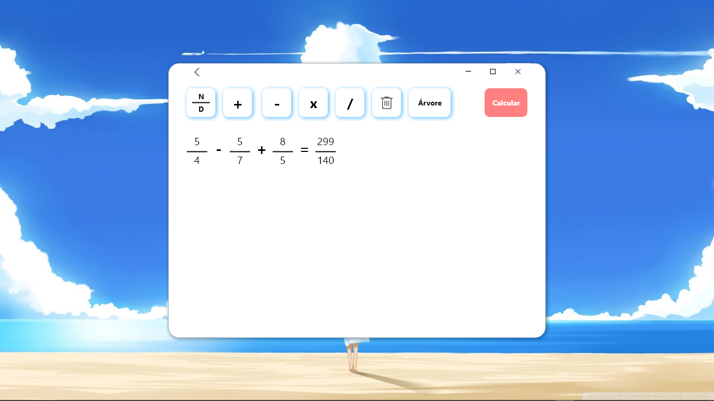
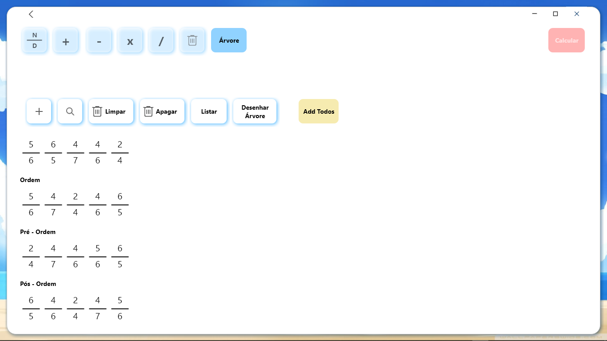

  

# Calculo de Frações & Árvore AVL
# * funcionalidade
* Calculo das 4 Operações FUndamentais SOma, Subtração, Multipicação, Divisão
* Criação da Ávore Avl
* Exibição dos dados em Ordem, Pré-Ordem e Pós-Ordem
* Procurar e Rempvoção da Fração na Árvore
* Geração do Grafico da Árvore Avl

## Previews

  

  

  

  

  

  

  

  

